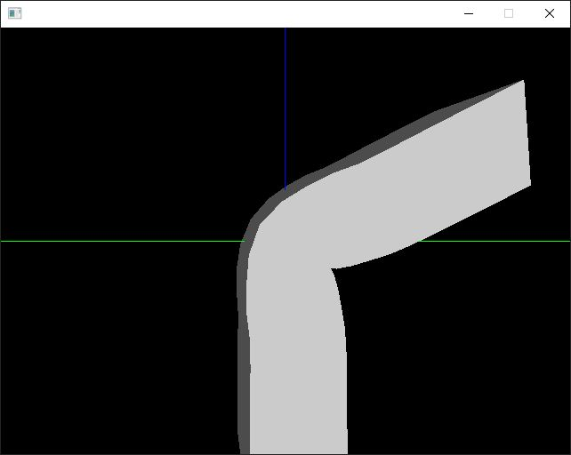
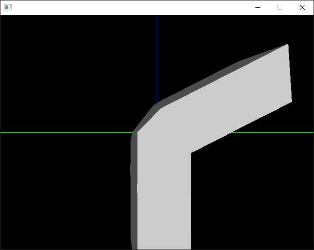
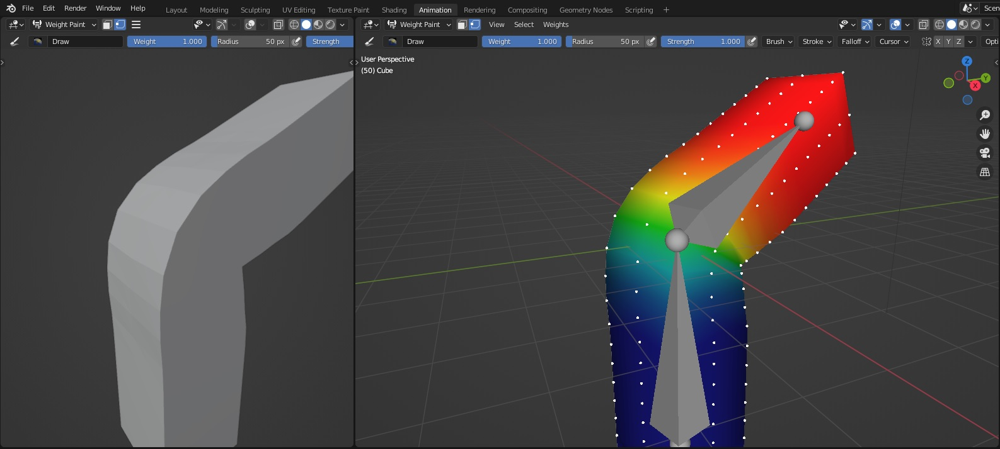
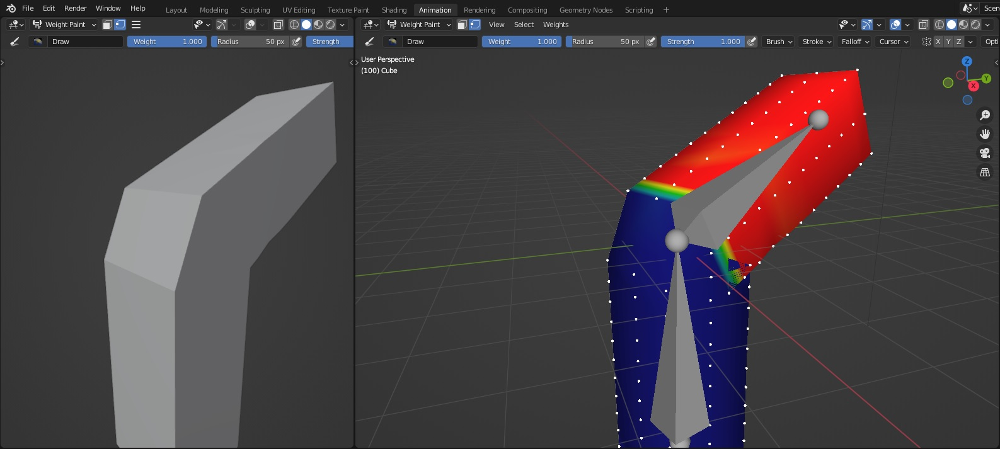

# Animation

Old project from 2014, about skinned animation (mesh animation with bones and vertex weight).  
Need to be updated :

* [x] ~~SDL2~~
* [ ] Clean warnings
* [ ] Opengl 3
* [x] ~~Exporter updated to new Blender API~~
* [ ] Exporter Improvement
  * [ ] Best file writting
  * [ ] Use loops
  * [ ] Do tringulation automatically (easier with loops)
  * [ ] Export in binary mode
  * [ ] Integration in Blender UI

